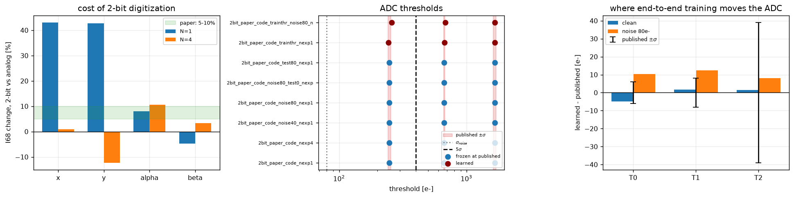
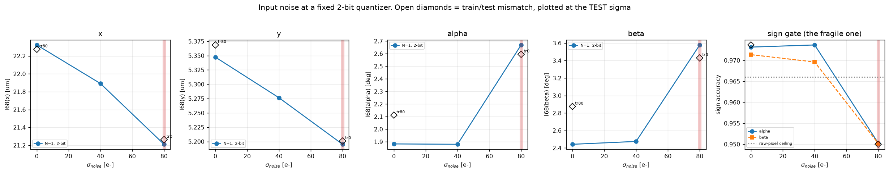
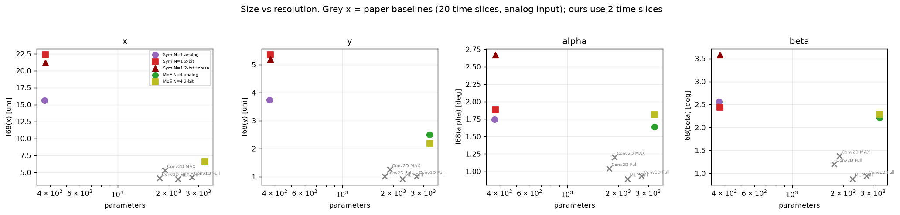
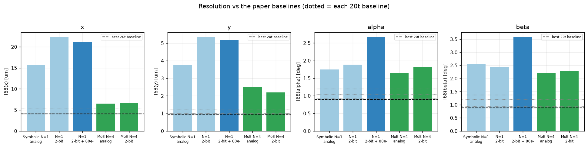
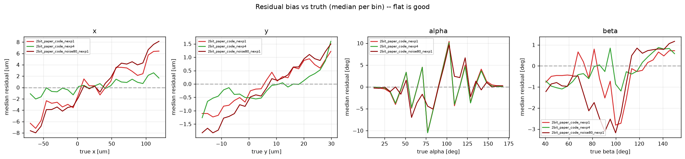

# Aug 17 algorithm meeting update
_All numbers recomputed from the run parquets by `scripts/make_meeting_report.py`._

## TL;DR
- **The MoE is the answer at 2 bits.** N=4 reaches **6.57 um** in x against **22.32 um** for the single formula (-71%), for 3272 parameters vs 376.
- **End-to-end threshold optimisation reproduces the published ADC.** Learned 243.2/669.6/1664.4 e- against the published 248/668/1663 (+-6/8/39): moved -4.8/+1.6/+1.4 e-, **inside the paper's error bars on all three**, with no resolution change.
- **Noise is an angle problem, not a position problem.** At the nominal 80 e-: alpha +41.8%, beta +46.6%, but x -5.0% and y -2.8%. Sign accuracy falls 0.973 -> 0.950 (alpha) and 0.971 -> 0.950 (beta).
- **A noisy input wants a higher ADC.** Retraining the thresholds at 80 e- moves them +10.4/+12.5/+8.0 e- -- all three UP -- and recovers sign accuracy to 0.957/0.956.
- **Where it breaks:** at 160 e- (2x nominal) with the published thresholds, T0 sits at 1.55 sigma, 27.5 pixels per frame fire on noise alone, 6.9% of codes flip, and the sign gate collapses to 0.66 balanced accuracy. That arm was stopped by its own pre-train assert. **The published thresholds are not safe at 2x nominal noise.**

## 1. Everything in one table

| model | params | I68 x [um] | I68 y [um] | I68 alpha [deg] | I68 beta [deg] | sign a | sign b |
|---|---|---|---|---|---|---|---|
| Symbolic N=1, analog | 372 | 15.61 | 3.75 | 1.74 | 2.56 | 0.967 | 0.967 |
| Symbolic N=1, **2-bit** | 376 | 22.32 | 5.35 | 1.88 | 2.44 | 0.973 | 0.971 |
| Symbolic N=1, 2-bit, learned T | 376 | 22.26 | 5.34 | 1.88 | 2.46 | 0.973 | 0.971 |
| Symbolic N=1, 2-bit + 80 e- noise | 376 | 21.21 | 5.20 | 2.67 | 3.58 | 0.950 | 0.950 |
| Symbolic N=1, 2-bit + noise, learned T | 376 | 21.32 | 5.20 | 2.40 | 3.24 | 0.957 | 0.956 |
| MoE N=4, analog | 3268 | 6.51 | 2.50 | 1.64 | 2.21 | 0.968 | 0.969 |
| MoE N=4, **2-bit** | 3272 | 6.57 | 2.19 | 1.81 | 2.29 | 0.974 | 0.972 |
| MoE N=4, 2-bit + 80 e- noise | _not run yet_ | | | | | | |
| _Conv2D MAX (20t), analog, 20 time slices_ | 1898 | 5.29 | 1.25 | 1.20 | 1.38 | - | - |
| _Conv2D Full (20t), analog, 20 time slices_ | 1767 | 4.14 | 1.00 | 1.04 | 1.20 | - | - |
| _Conv1D Full (20t), analog, 20 time slices_ | 2734 | 4.29 | 1.01 | 0.93 | 0.94 | - | - |
| _MLP Full (20t), analog, 20 time slices_ | 2264 | 4.05 | 0.92 | 0.89 | 0.88 | - | - |

Baselines use **20 time slices and analog input**; ours use **2 time slices** and, where marked, 2-bit input. So they are an upper reference, not a like-for-like comparison -- the interesting column is parameters against resolution.

## 2. Input digitization

Cost of going to 2 bits, against the matched analog model:

| | x | y | alpha | beta |
|---|---|---|---|---|
| N=1 | +43.0% | +42.7% | +8.0% | -4.7% |
| N=4 | +0.9% | -12.3% | +10.5% | +3.3% |

The paper quotes 5-10% for its own models. Our **angles** sit in that band; our **positions** cost much more. Worth saying out loud: our analog x is already weak, so the x number mixes the quantization cost with whatever limits x in the first place.

## 3. Input noise

**Train/test mismatch.** Training clean and testing at 80 e- gives alpha 2.59 deg, against 2.67 deg for the model trained at 80 e-. Noise-aware training buys **nothing** here -- the model is inherently robust rather than trained into robustness. The reverse arm (train noisy, test clean) costs +12.1% on alpha, so training on noise is mildly harmful if the detector turns out quieter than expected.

## 4. Size vs resolution

## 5. Caveats and what is still open

- Still training: `digi_2bit_paper_code_noise80_nexp4`, `digi_analog_nexp1`, `digi_analog_nexp4`. Re-run this script when they land.
- **The analog reference is not yet like-for-like.** `symbolic_axisfix_nexp*` was trained by the notebook pipeline, before `train_arm.py` existed, with its own sign calibration. The 2-bit-vs-analog deltas above therefore mix the quantization cost with pipeline differences -- which is why N=4 appears to get *better* in y at 2 bits. `digi_analog_nexp1/4` are training now on the identical script; use those before quoting a digitization cost for N=4.
- 3-bit and 4-bit points exist only with the **superseded** occupancy-derived thresholds (T0 = 100 e- = 1.25 sigma_noise) and are not comparable to anything here. They are excluded on purpose. If a bit-depth curve is wanted, those need re-running at derived-but-sane thresholds.
- The train and eval splits carry different `labels_scale` (0.42% on x, 0.64% on cotB), which puts a slope of that size in every residual. Consistent across all runs here, so comparisons are unaffected; it matters only for sub-percent claims.
- Baseline parquets come from the paper test set, ours from the centeredIncidence split. Resolution comparison is fair; absolute bias offsets across the two families are not.
